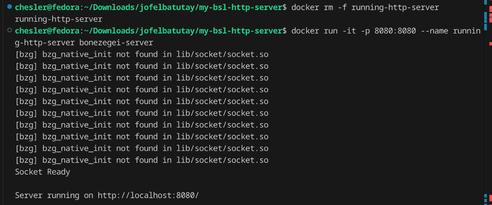
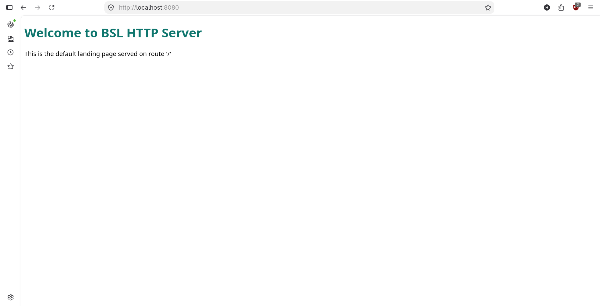
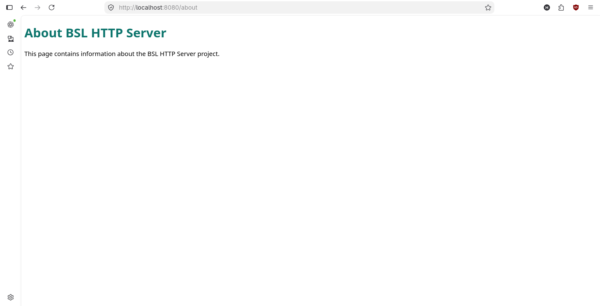
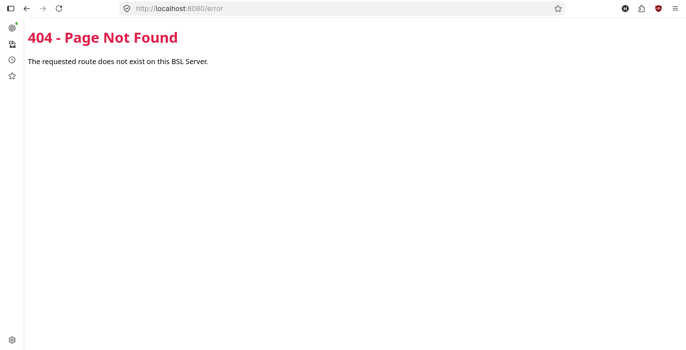

# my-bsl-http-server

A minimal HTTP server implemented in Bonezegei Scripting Language (BSL) using the BSL Socket library.

## Project Description
This project implements a simple low-level HTTP server that listens on port 8080 and serves three routes:
- `/` — Default landing page (200 OK)
- `/about` — About page with project/developer details (200 OK)
- Any other path — 404 Not Found page

## Installation & Setup

### Option 1: Native Setup (Standard)

#### Prerequisites
- Linux or Windows environment (or GitHub Codespaces for macOS).
- VS Code with the **Bonezegei Scripting Language Formatter** extension installed.

#### Step-by-Step Instructions
1. **Install the Bonezegei Interpreter**:
   Follow the guide inside the VS Code extension to install the runtime for your operating system:
   - For Debian/Ubuntu-based Linux:
     ```bash
     sudo dpkg -i pkg/Bonezegei-x86.deb
     ```
   - For Windows: Run the installer executable provided in the extension guide.

2. **Install the Socket Library**:
   Install the official BSL socket module using the package CLI:
   ```bash
   bzg install socket
   ```

3. **Run the Server**:
   Start the HTTP server directly using the BSL interpreter:
   ```bash
   bzg src/http.bzg
   ```

---

### Option 2: Dockerized Linux Setup (Containerized)

The project includes an isolated Ubuntu Docker configuration to handle the 32-bit architecture dependencies and `GLIBC 2.38+` requirements automatically.

#### Prerequisites
- [Docker](https://docker.com) installed and running on your host machine.
- The `Bonezegei-x86.deb` package placed inside the `pkg/` folder.

#### Step-by-Step Instructions
1. **Build the Docker Image**:
   From the repository root, build the container image:
   ```bash
   docker build -t bonezegei-server .
   ```

2. **Run the Container**:
   Start the server container with port 8080 bound to the host:
   ```bash
   docker run -it -p 8080:8080 --name running-http-server bonezegei-server
   ```
   
## Usage
While the container terminal is active, open a web browser tab or open a separate terminal window on your host computer to inspect the server endpoints:
- `http://localhost:8080/` — Home page
- `http://localhost:8080/about` — About page
- `http://localhost:8080/anything` — 404 error fall-through route

## Documentation / Screenshots

### Terminal Startup


### Home Page (`/`)


### About Page (`/about`)


### 404 Fallback (`/anything`)


## Structural & Environment Adaptations
- **Native Extensions Fixed**: Windows binary path indicators (`.dll`) were updated across `lib/socket.bzg` and `lib/http/http.bzg` to point to the Linux environment architecture (`lib/socket/socket.so` / `lib/http/http.so`).
- **Dependency Automation**: The `Dockerfile` handles running `bzg install socket` automatically during image build compilation.
- **Unreachable Block Silenced**: The trailing `socket_cleanup()` call has been muted since the continuous server script processes inside an endless execution matrix loop (`while (1)`).
- **Dot-Notation Bypass**: Route checking relies directly on scalar evaluation checks rather than non-existent string methods (`data.indexOf`).
